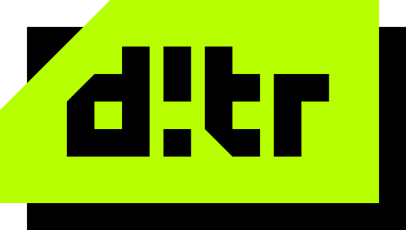
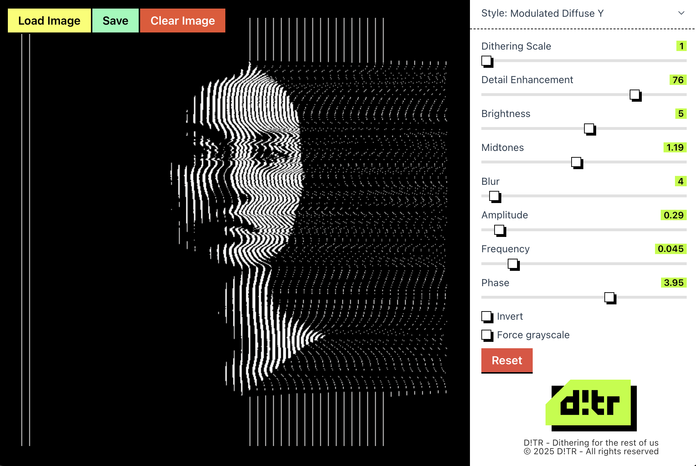

# D!TR - Image Dithering

A web application that allows you to upload images and apply a variety of dithering and analog modulation effects.

## Features

- Image upload with preview
- Real-time dithering, glitch and analog modulation effect application

- Modern, responsive UI
- **FM-based analog glitch effects:**
  - **Modulated Diffuse Y**: Frequency modulation/demodulation along the Y axis (horizontal scanlines)
  - **Modulated Diffuse X**: Frequency modulation/demodulation along the X axis (vertical scanlines)
- Interactive controls for:
  - Amplitude
  - Frequency
  - Phase
  - Noise (glitch intensity)
- Classic dithering algorithms (Floyd-Steinberg, Bayer, Atkinson, etc.)
- Invert, scale, blur, and other image adjustments

## Prerequisites

- Node.js 20 or later
- npm (comes with Node.js) or yarn (recommended)

## Installation

1. Clone the repository:
```bash
git clone https://github.com/rmarchet/web-dither.git
cd web-dither
```

2. Install dependencies:
```bash
yarn install
```

## Development

To start the development server:

```bash
yarn start
```

This will start the development server at `http://localhost:3000`.

## Building for Production

To create a production build:

```bash
yarn build
```

The built files will be in the `dist` directory.

## How to Use



1. Click the "Load Image" button to select an image from your computer
2. The application will display a grayscale version of the image with no filters applied
3. Select a dithering or modulation style from the dropdown on the right
4. For **Modulated Diffuse Y** or **Modulated Diffuse X**, use the dedicated sliders to control amplitude, frequency, phase, block size, noise, and line spacing for analog/CRT/glitch effects
5. The effect is applied automatically and updates in real time

## Technologies Used

- React 18
- TypeScript
- Rollup (bundler)
- CSS Modules
